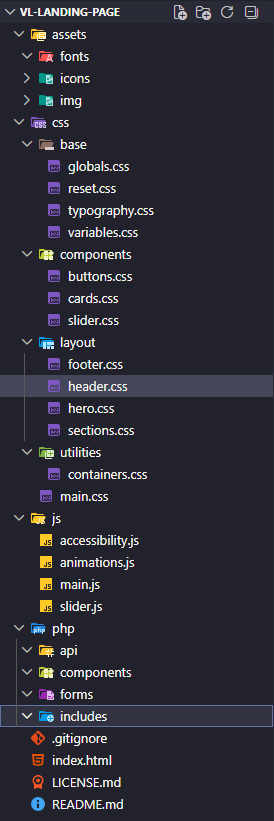

# VL Estética & Fisioterapia — Landing Page

---

# 🇧🇷 PT-BR

## 📌 Sobre o projeto

Este projeto é uma landing page institucional desenvolvida para a clínica **VL Estética & Fisioterapia**, com foco em apresentar serviços, equipe, depoimentos e facilitar o contato direto com clientes.

O objetivo principal é unir **design moderno, performance, acessibilidade e escalabilidade futura**, permitindo evolução natural para backend em PHP.

---

## 🎯 Objetivos

- Criar uma landing page moderna e responsiva
- Garantir performance e leveza no carregamento
- Estruturar CSS modular e escalável
- Implementar UX fluida com animações suaves
- Preparar base para backend em PHP
- Facilitar conversão (WhatsApp, ligação e localização)

---

## 🧱 Arquitetura do projeto

A estrutura de pastas está organizada de forma modular, separando responsabilidades:

> 📌 A estrutura visual completa está documentada no print do projeto (referência principal da arquitetura).

### Organização geral:

- `/css`
  - base (reset, variables, typography, globals)
  - layout (header, footer, grid)
  - components (buttons, cards, slider)
  - sections (hero, services, team, etc.)
  - utils (containers, spacing, helpers)

- `/js`
  - main.js (controle geral do frontend)
  - slider.js (carrossel de serviços)
  - future modules (accessibility, animations)

- `/assets`
  - imagens otimizadas WebP
  - ícones e mídia

- `/php` *(estrutura futura)*
  - api/
  - includes/
  - components/
  - forms/

---

## ⚙️ Tecnologias utilizadas

- HTML5 semântico
- CSS3 moderno (Flexbox + Grid)
- JavaScript Vanilla
- AOS (Animate On Scroll)
- Google Fonts
- Otimização de imagens (WebP)
- Arquitetura modular CSS

---

## 🎨 Features

- Header fixo com menu responsivo
- Slider automático de serviços
- Seção de equipe com layout responsivo
- Depoimentos com grid responsivo
- CTA com foco em conversão
- Mapa com redirecionamento Google Maps
- Footer completo com navegação e contatos
- Menu mobile com acessibilidade (ARIA)

---

## 📱 Responsividade

O projeto foi desenvolvido com abordagem mobile-first, adaptando:

- Smartphones
- Tablets
- Desktops
- Telas grandes (Full HD+)

---

## 🚀 Performance

- Lazy loading em imagens
- Uso de WebP
- Animações leves
- CSS modular para evitar redundância
- JS vanilla sem dependências pesadas

---

## 🔧 Futuro (PHP Backend)

O projeto está preparado para evolução com:

- Formulário de contato com envio de email
- Estrutura de includes reutilizáveis
- Possível painel administrativo
- Expansão para sistema de agendamento

---

## 🧠 Decisões técnicas

- Separação modular de CSS para escalabilidade
- JavaScript sem frameworks para leveza
- Uso de animações leves para UX fluida
- Estrutura pensada para crescimento backend

---

## 📸 Interface

A estrutura visual do projeto segue organização modular conforme print da arquitetura do sistema.

---

## 📬 Contato

Projeto desenvolvido para fins profissionais e institucionais.

---

---

# 🇺🇸 ENGLISH

## 📌 About the project

This project is an institutional landing page developed for **VL Estética & Fisioterapia**, focused on presenting services, team, testimonials, and enabling direct client contact.

The main goal is to combine **modern design, performance, accessibility, and future scalability**, allowing smooth evolution into a PHP backend.

---

## 🎯 Objectives

- Build a modern responsive landing page
- Ensure high performance and fast loading
- Create scalable modular CSS architecture
- Implement smooth UX animations
- Prepare backend foundation in PHP
- Optimize conversion (WhatsApp, calls, location access)

---

## 🧱 Project architecture

The folder structure is organized modularly, separating responsibilities:

> 📌 The full structure is visually documented in the project screenshot (main architectural reference).

### General structure:

- `/css`
  - base (reset, variables, typography, globals)
  - layout (header, footer, grid)
  - components (buttons, cards, slider)
  - sections (hero, services, team, etc.)
  - utils (containers, spacing, helpers)

- `/js`
  - main.js (global frontend logic)
  - slider.js (services carousel)
  - future modules (accessibility, animations)

- `/assets`
  - optimized WebP images
  - icons and media

- `/php` *(future structure)*
  - api/
  - includes/
  - components/
  - forms/

---

## ⚙️ Tech stack

- HTML5 semantic structure
- Modern CSS3 (Flexbox + Grid)
- Vanilla JavaScript
- AOS (Animate On Scroll)
- Google Fonts
- WebP image optimization
- Modular CSS architecture

---

## 🎨 Features

- Fixed responsive header
- Auto sliding services carousel
- Responsive team section
- Testimonials grid
- Conversion-focused CTA section
- Google Maps integration
- Full footer with navigation & contacts
- Accessible mobile menu (ARIA support)

---

## 📱 Responsiveness

Mobile-first approach supporting:

- Smartphones
- Tablets
- Desktops
- Large screens

---

## 🚀 Performance

- Lazy-loaded images
- WebP format usage
- Lightweight animations
- Modular CSS structure
- Vanilla JS (no heavy frameworks)

---

## 🔧 Future (PHP Backend)

Prepared for backend evolution:

- Contact form with email sending
- Reusable PHP includes structure
- Admin panel (optional)
- Appointment scheduling system

---

## 🧠 Technical decisions

- Modular CSS architecture for scalability
- Vanilla JS for performance
- Lightweight UX animations
- Backend-ready structure design

---

## 📸 UI Reference

The UI structure follows the modular system shown in the project architecture screenshot.

---

## 📬 Contact

This project was built for professional and institutional purposes.